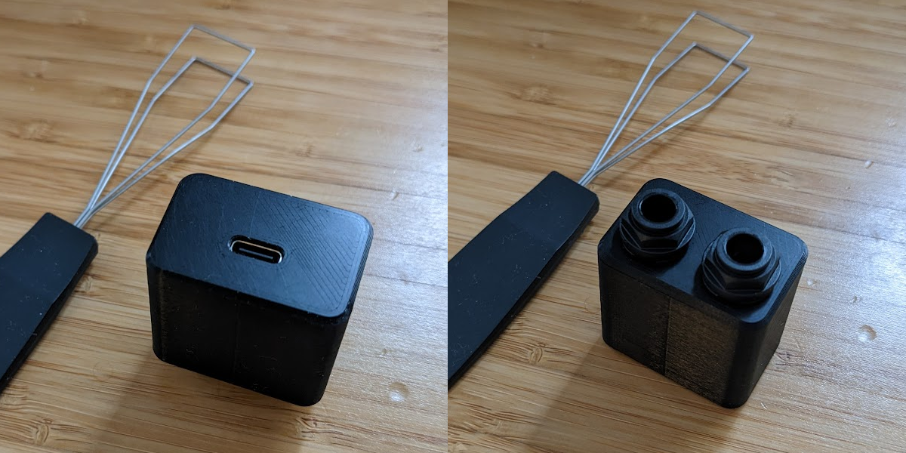
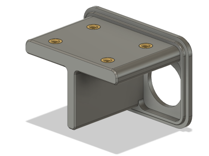
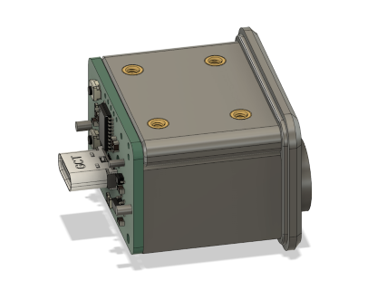
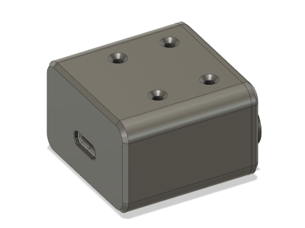
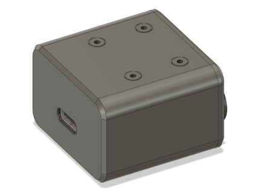

# Page Turner

This is an STM32-based "keyboard" which maps a pair of foot pedals with 6.35 mm (1/4") phone jacks to left/right arrow keys (or any other two keys), designed for switching pages on a sheet music reader. It was designed to be as small as possible while still being hand-solderable.

# PCB

The [pcb](./pcb) folder contains a [KiCad](https://www.kicad.org/) project for the PCB. It requires 4 layers and a 1.6 mm thick PCB.

All parts are hand-solderable. I recommend starting from the USB port and working out from the center on the top side, then soldering the phone jacks last.

## Bill of Materials

| References | Part              | Manufacturer       | Package  | Qty. | Description           |
| ---------- | ----------------- | ------------------ | -------- | ---- | --------------------- |
| C5         | 10n capacitor     |                    | 0603     | 1    | SMT Ceramic capacitor |
| C3, C7     | 100n capacitor    |                    | 0603     | 2    | SMT Ceramic capacitor |
| C1, C2, C6 | 1u capacitor      |                    | 0603     | 3    | SMT Ceramic capacitor |
| C4         | 4.7u capacitor    |                    | 0603     | 1    | SMT Ceramic capacitor |
| R1, R2     | 5.1k resistor     |                    | 0603     | 2    | SMT resistor          |
| R3         | 10k resistor      |                    | 0603     | 1    | SMT resistor          |
| D1, D2     | SD03C-7           | Diodes Inc.        | SOD-323  | 2    | TVS diode             |
| D3         | PRTR5V0U2X,215    | Nexperia           | SOT-143  | 1    | TVS diode             |
| U1         | STM32F042F6P6TR   | STMicroelectronics | TSSOP-20 | 1    | ARM microcontroller   |
| U2         | TPS7A0533PDBVR    | Texas Instruments  | SOT-23-5 | 1    | 3.3V regulator        |
| SW1, SW2   | B3U-1000P-B       | Omron              |          | 2    | Tactile switch        |
| J1, J2     | NJ2FD-V           | Neutrik            |          | 2    | 6.35 mm phone jack    |
| J3         | USB4145-03-0170-C | GCT                |          | 1    | USB-C connector       |

D1, D2, and D3 are optional. They provide some ESD protection.

U2 may be substituted with any other 3.3V regulator that takes 5V input and uses the same footprint and pinout, e.g. TPS7A0333PDBVR.

# Firmware

The [src](./src) folder contains an Arduino sketch. It can be modified as necessary to change the two keys or if your foot pedals are normally closed instead of normally open.

You will need a SWD programmer such as a J-Link. I used a [Nordic nRF5340 DK](https://www.nordicsemi.com/Products/Development-hardware/nRF5340-DK). Other programmers such as a Black Magic Probe or STLink may work, but I have not tested these. Flashing instructions below assume using a J-Link.

There are pads for a Tag-Connect TC2030 "no legs" cable, or you can use the five pads at the top of the PCB to connect your programmer (note that these have 2 mm spacing instead of 2.54 mm due to size constraints).

To compile and flash the firmware:

1. Install [STM32CubeProgrammer](https://www.st.com/en/development-tools/stm32cubeprog.html)
2. Install and open [Arduino IDE](https://www.arduino.cc/en/software)
3. Install the [Arduino core for STM32](https://github.com/stm32duino/Arduino_Core_STM32/wiki/Getting-Started)
4. Open [src/page_turner.ino](./src/page_turner.ino) in Arduino IDE
5. Select **Tools > Board > STM32 MCU based boards > Generic STM32F0 series**
6. Select **Tools > Board part number > Generif F042F6Px**
7. Select **Tools > USB support (if available) > HID (keyboard and mouse)**
8. Select **Tools > Upload method > STM32CubeProgrammer (J-Link)**
9. Plug the PCB to USB power and connect your programmer to it.
10. Select **Sketch > Upload Using Programmer**

I ran into an issue where, after being flashed with Arduino firmware, STM32CubeProgrammer was unable to identify the board afterwards. To fix this, you can run STM32CubeProgrammer and try to connect. This will fail and ask you to select the type of processor. Select Cortex M0 to finish connecting. Run a full chip erase, then disconnect, and you will be able to flash again.

## Enclosure

The [enclosure](./enclosure) folder contains CAD files that can be used to create a 3D printed enclosure.

## Bill of Materials

| Part                                        | Qty. |
| ------------------------------------------- | ---- |
| [Back](./enclosure/Back.3mf) (3D printed)   | 1    |
| [Front](./enclosure/Front.3mf) (3D printed) | 1    |
| M2 x 3 mm heat-set insert                   | 4    |
| M2 x 5 mm counersunk screw                  | 4    |

## Assembly

1. Using a soldering iron, install the four heat set inserts into the holes in the back piece.

   

2. Place the PCB assembly into the back piece. The longer side of the PCB should line up with side of the back piece containing the heat-set inserts.

   

3. Press the caps into the 6.35 mm phone jacks and rotate them clockwise to lock them into place.
4. Slide the front piece on, lining up the four holes with the heat set inserts.

   

5. Install the four screws.

   
